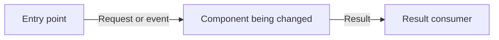

# Plan file and index format

Read before creating or rewriting a plan file or its index row. This is the shared format consumed by Run; retain it across revisions. New task lines start pending; preserved Run progress takes precedence over the template defaults. Read [approval.md](approval.md) before a freeze or a revision to an approved plan.

## The plan format

`.velo/tasks/<slug>/task-breakdown.md`, exactly this shape:

````markdown
# Task Breakdown — <slug>

- Planned-via: /velo:plan
- Task-folder: .velo/tasks/<slug>/
- Mode: task
- Product: <matching .velo/products/ slug, or —>
- Depth: —
- Pairing: —
- Branch-convention: <slug>-m<i>
- Plan-version: <N>
- Approval: —
- Phase: PLAN (Plan — v<N> awaiting approval)
- Last gate passed: —
- Rework cycles: —
- Re-entry: —
- Created: <YYYY-MM-DD>
- Updated: <YYYY-MM-DD HH:MM>
- Summary: <one line — what the planned work delivers>

## Original request
<Copy the user’s original request here without changing it.>

## Assumptions (working — flag if wrong)
- <term or decision> → <the interpretation the plan is built on>

## Constraints/notes
- <a constraint the plan must respect, or an event bullet — or the literal (none)>

## Architecture
<Explain the proposed design and replace the illustrative nodes below with task-specific components.>



## Acceptance criteria
- AC1: <Observable behavior> · milestone: M1 · tasks: T1 · verify: browser

## Verification
- App startup: <project command, or not needed>
- Target: <local URL and route, or API/command target>
- Test data: <fixtures and required starting state>
- Access: <required test account/session, or none; never credentials>
- Browser verifier: <Chrome DevTools MCP, Playwriter, either available, or not needed>
- AC1: <actions or inputs> → <expected observable result>

## Artifacts
(none)

## M1 — <milestone name>
Branch: <slug>-m1
- T1 · <agent> — <what this task delivers> · skills: <comma-separated labels, or —> · needs: — · Status: pending
- T2 · <agent> — <what this task delivers> · skills: — · needs: T1 · Status: pending

Execution: batch 1 — T1; batch 2 — T2 after T1.
````

**Header keys** — every key appears on every write, in this order:

- Keys Plan does not compute — `Depth`, `Pairing`, `Rework cycles`, `Re-entry` — hold `—` on a plan file Plan created; Run's recorded values are never reset by a Plan revision.
- `Planned-via:` — set at plan file creation and never rewritten: `/velo:plan`.
- `Product:` — the matching `.velo/products/` slug when the work clearly belongs to one, else `—`.
- `Plan-version:` and `Approval:` — per [approval.md](approval.md#versioning-and-approval) when changing version or approval state.
- `Phase:` — `PLAN (Plan — v<N> awaiting approval)` while unapproved; `PLAN (Plan — v<N> approved)` once frozen.
- `Last gate passed:` — `—` until the freeze; then `PLAN_APPROVAL (Plan approval — v<N>)`.
- `Created:` is `YYYY-MM-DD`, set once. `Updated:` is `YYYY-MM-DD HH:MM` and advances on every plan file write. Both come from the runtime's local clock (`date`-sourced), never invented.

**Sections**:

- `## Original request` — the user’s original request, kept unchanged. Later revision requests change the plan body and the event bullets, never this section.
- `## Assumptions (working — flag if wrong)` — every load-bearing interpretation as a `<term> → <interpretation>` bullet, including answers gathered during clarification.
- `## Constraints/notes` — constraints the plan must respect, plus the event log: one `- ` bullet per versioning event (freeze or bump, formats in [approval.md](approval.md)). Bullets only, never headings; the literal `(none)` when empty.
- `## Architecture` — a short design explanation and a fenced `mermaid` diagram, following the guidance below.
- `## Acceptance criteria` — stable AC ids with observable outcomes, owning milestones, implementation task ids, and verification methods.
- `## Verification` — setup, target, data, access requirements, and steps/expected results for each criterion. Define expectations here; Run records actual results as event bullets.
- `## Artifacts` — files in the task folder beyond the plan file. Plan writes only the plan file, so `(none)` is the normal value.

## Acceptance criteria and verification

- For each new plan, define concrete user-visible or technical outcomes with sequential ids (`AC1`, `AC2`, …). Keep retained ids stable during revisions. A criterion describes what must be true, not an implementation instruction or a claim that a test passed.
- Map every criterion to a milestone and existing task ids. Its required behavior must be achievable by that milestone; put cross-milestone outcomes in the final relevant milestone. One criterion can require several verification cases. Ensure the milestones collectively cover every criterion before presenting the plan.
- Choose `browser`, `api`, `command`, or `manual` verification according to what proves the outcome. Name Chrome DevTools MCP or Playwriter if a provider is required; otherwise allow either available provider. Run uses Verify to collect evidence. Browser-only evidence cannot prove server-side persistence, authorization enforcement, or background processing; name an API/database/command check when needed. Manual verification requires recorded human evidence, not an agent guess.
- For browser criteria, record the app startup command when known, target URL/route, reproducible test data and initial state, required login/access, actions, and expected visible results. Use a test environment; do not include passwords or tokens. Clarify missing setup that would prevent verification before approval.
- Plan reads to define verification; it does not start the app, operate the browser, or install browser tooling. State unverified setup assumptions explicitly. Browser tooling is an external dependency, not a new Velo mode or bundled capability.
- An approved plan's criteria, mappings, and expected results are read-only in Run. Changing required evidence after approval follows [approval.md](approval.md). Run records pass/fail/blocked evidence without weakening expectations.
- Existing approved plans without these sections remain executable under their existing checks. Adding required criteria or browser verification to such a plan requires Plan revision and approval; Run must not silently impose or invent them.

## Architecture diagrams

- Include the Architecture section in each new plan. Use a Mermaid diagram when components, boundaries, or data flow help explain the change, or whenever the user explicitly requests one. For a small change with no meaningful architecture, write `Not needed — <short reason>` instead of an artificial diagram.
- Show the proposed design relevant to this task: components and how requests, events, or data move between them. Use `flowchart LR` or `flowchart TD`; use `sequenceDiagram` when interaction order is the central design concern. Keep the diagram inline in the plan file; no separate diagram artifact is required.
- Replace the template's illustrative nodes with actual existing or proposed components. Label new components and changed connections clearly; mark uncertain details as assumptions. Do not invent services, storage, or APIs merely to fill the diagram.
- Use simple node identifiers, quoted readable labels, and labeled edges where they clarify the flow. Add a short explanation of the design decision and keep it consistent with the task scope and milestones. Show system architecture here, not Velo's planning state machine or task dependency graph.
- Revise the diagram when feedback changes the design. After approval, architectural changes that alter scope, affected components, risk, or required evidence follow the material-change versioning rules in [approval.md](approval.md). Layout or wording-only edits do not require a version bump.
- Existing plans without this section remain readable. Add it when planning or revising relevant architectural work; Run must not add or rewrite it during execution.

**Milestones and task lines**:

- At least one milestone, `## M<i> — <name>`, in delivery order. Each opens with `Branch: <slug>-m<i>` — the branch name Run uses; Plan itself never creates one.
- The task-line grammar, exactly: `- T<n> · <agent> — <what it delivers> · skills: <labels, or —> · needs: <— or comma-separated earlier T ids> · Status: pending`
- `T<n>` ids are sequential and never repeat, continuing across milestones. `needs:` may reference tasks in the same or an earlier milestone.
- The `<agent>` and `skills:` fields are advisory planning labels for Run. Plan itself has no roster and composes no skills — `skills: —` is always valid, and Plan must never claim these labels auto-execute anything.
- `Status:` is always `pending` when Plan writes a line; Plan never marks progress.
- Each milestone closes with one `Execution:` line batching within that milestone only: tasks whose `needs:` are met batch together, later batches name what they wait on — e.g. `Execution: batch 1 — T1, T2; batch 2 — T3 after T1.`

## The index

`.velo/tasks/index.md` starts as:

```
# Velo — Task Index

Newest-first: new tasks are inserted directly below the header row.

| Task | Status | Created | Updated | Summary |
|---|---|---|---|---|
```

Plan inserts its row directly below the `|---|` row, newest-first:

```
| [<slug>](<slug>/) | planning | <YYYY-MM-DD> | <YYYY-MM-DD> | <one-line summary> |
```

Status is `planning` while unapproved and `planned` once frozen; a post-approval material change flips it back to `planning`. The Updated date advances with every plan file write. Rows owned by other Velo tooling keep their own statuses — Plan touches only its own task's row.
