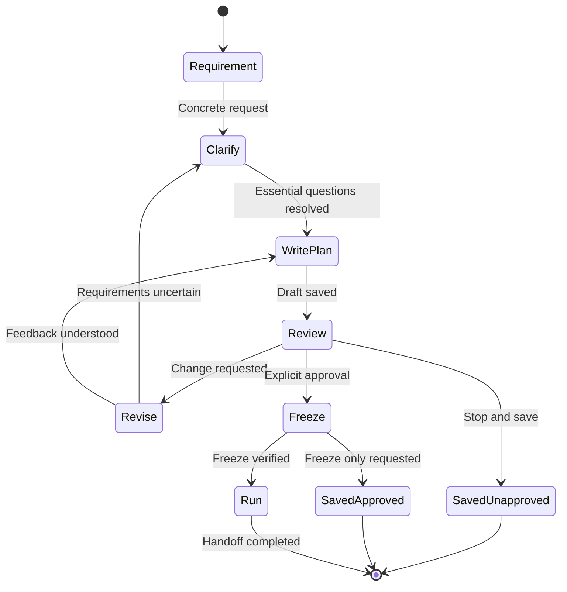

# Plan workflow state machine

Read for an actionable planning request or a response to a plan. Follow the current state, its instructions, and its transition conditions. Load supporting guides only when needed. This is a shared instruction-driven state machine for Claude Code and Codex; it does not add an enforcing runtime.

The two exits from Freeze are mutually exclusive: enter Run only after a verified freeze AND when the user has not requested freeze only or stopped execution. Failed verification stays blocked at Freeze; it never reaches Run.

## States, actions, and transitions

| State | Entry action and guide | Condition → next state |
|---|---|---|
| Requirement | Capture the goal, constraints, and original request. Read [drafting.md](drafting.md) to resolve an existing plan file or choose a new slug. | Concrete request → Clarify. Missing requirement → ask and wait here. |
| Clarify | Read relevant repository context. Follow [drafting.md](drafting.md): ask only questions affecting scope, approach, or ordering; record reasonable assumptions. | Essential questions resolved or none needed → WritePlan. Otherwise wait here. |
| WritePlan | Load [plan-format.md](plan-format.md) before writing. Use [drafting.md](drafting.md) to save milestones, tasks, dependencies, execution batches, and the index row. Include the Architecture section per the format guide; define acceptance criteria, task coverage, and verification setup. | Successful save → Review. Failed save → report and stop here; never present an unsaved draft as persisted. |
| Review | Present the saved plan using [drafting.md](drafting.md). Load [approval.md](approval.md); offer Approve and run, Revise, or Stop and save. Explain that approval freezes and starts Run. | Requested change → Revise. Explicit approval of the reviewed version → Freeze. Stop and save → SavedUnapproved. Answer questions here; questions and silence do not count as approval. |
| Revise | Capture feedback. Load [drafting.md](drafting.md); for an approved plan file or paused Run also load [approval.md](approval.md) before any edit. Preserve existing Run progress. | Uncertainty affecting requirements → Clarify. Feedback understood → WritePlan. Neither transition carries approval forward for a material change. |
| Freeze | Record the explicit approval per [approval.md](approval.md). Read [plan-format.md](plan-format.md) before writes. Re-read the saved plan file and index to verify the freeze. | Verified freeze and execution permitted → Run. Verified freeze with explicit freeze-only instruction → SavedApproved. Failed/mismatched write → stop here and report. |
| Run | Perform the handoff below using the exact approved plan file. Run owns implementation, checks, review, rework, and local commits. | Exit the planning state machine after actual handoff; execution follows Run’s contract. |
| SavedUnapproved / SavedApproved | Report the plan file path and actual approval state, then stop. | A later user request resumes according to the saved state and authorization. |

## Revision loop

The loop is Review → Revise → WritePlan → Review. When feedback changes requirements, use Revise → Clarify → WritePlan → Review. Carry the specific feedback forward, update the same plan file, and summarize what changed. Preserve the original request and retained Run progress; never create duplicate tasks merely to revise a plan.

Unapproved drafts revise in place. A material change after approval bumps `Plan-version:`, clears approval, and requires reapproval under [approval.md](approval.md). Wording-only changes preserve the standing approval. The number of loop iterations is not the plan version, and existing approval alone does not authorize a fresh execution.

Repeat only to address new feedback or information. If a decision remains unresolved, name it and wait. Never infer approval from repeated drafts, elapsed time, or silence. The reviewed version must match the version that is frozen.

## Freeze and Run handoff

1. Bind approval to the exact plan and version reviewed. Clarify ambiguity; an approval response that also requests changes transitions to Revise first.
2. Persist the freeze exactly as [approval.md](approval.md) defines. Verify matching `Plan-version:`, `Approval:`, `Phase: PLAN (Plan — v<N> approved)`, and index status `planned`.
3. Announce the frozen version and plan file path. Unless the user requested freeze only or stopped execution, enter Run without requiring a separate invocation.
4. On Codex, load [Run SKILL.md](../../run/SKILL.md) and its playbook. On Claude Code, load [commands/run.md](../../../../commands/run.md). Pass the exact plan file path and approved version. Load the actual instructions and continue under them; printing a slash command alone is not a handoff.
5. Run re-verifies the freeze and applies its normal repository checks, execution disclosure, milestone gates, and pause rules. Plan's restrictions govern until this handoff; Run's scope governs afterward. Approval authorizes Run's local commits, not pushing, merging, or opening a PR.

## Resume and state ownership

These planning states guide the conversation; they are not additional persisted `Phase:` values. Keep the current plan file schema. Before a draft is saved, the requirement and pending questions live in the conversation. After saving, the plan file is authoritative for version, approval, and execution progress. If conversation context needed for a pending decision is unavailable, ask rather than inventing it.

On interruption, inspect the intended plan file rather than replaying steps. An unapproved plan resumes at Review, or Revise when feedback is pending. A frozen plan awaiting handoff may enter Run only when the conversation establishes approval-and-run authorization; an explicit freeze-only instruction remains in force. Existing Run progress resumes under Run’s rules, never starts a second execution. A done plan file stays done. A Run pause requiring plan changes returns to Revise only when the user requests planning. Missing plan file identity or authorization requires clarification.
