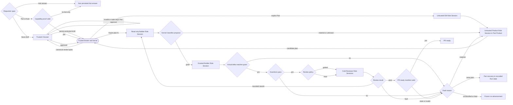

```mermaid
flowchart LR
    U{Requester span} -->|Ask answer| A[Non persisted Ask answer]
    U -->|Save draft| C[Trusted Chooser]
    C -->|persist protected draft| K([Trusted Broker and kernel])
    U -->|Pair or Auto| E{Capability proof valid}
    E -->|yes| K
    E -->|no Ask only| A
    K -->|explicit Pair| N[Untrusted EM Role Session]
    N --> P[Untrusted Product Role Session in Pair Product]
    P -->|candidate plan| K
    K -->|canonical render bytes| C
    C -->|approved| K
    C -->|invalid or stale stays Pair approval| C
    K -->|frozen plan N| B[Read only Builder Role Session]
    B --> X{Kernel classifies proposal}
    X -->|grant| Z[Granted Builder Role Session]
    X -->|material or unknown| P
    Z --> D{Actual delta matches grant}
    D -->|yes| S{Assertions pass}
    D -->|no| T{Fault reason}
    S -->|yes| Y{Review policy}
    S -->|no| T
    Y -->|guided| R[Cold Reviewer Role Sessions]
    Y -->|Auto| R
    R --> Q{Review result}
    Q -->|pass| F{PR ready manifest valid}
    Q -->|bounded rework| B
    Q -->|fault| T
    F -->|yes| O[PR ready]
    F -->|stale or invalid| T
    T -->|same plan| L[Pair recovery to recorded Run state]
    T -->|material| P
    T -->|unclassified or fatal| J[Frozen no advancement]
```
