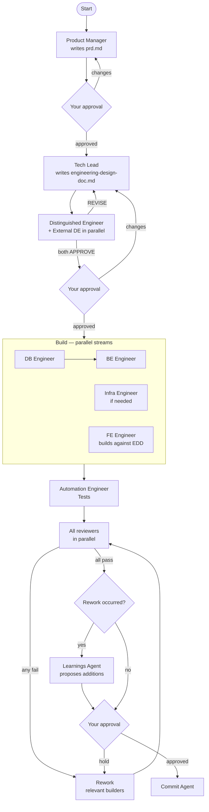
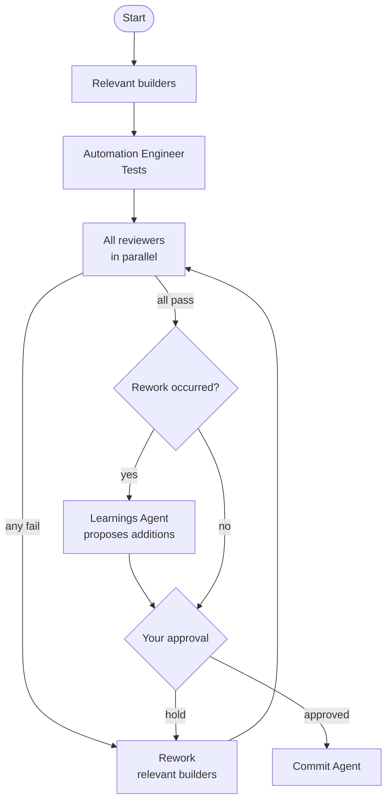

  

<b>Rajasekar's high-velocity engineering team, running on Claude Code.</b>

Velo is an agentic engineering team — a full squad of specialised Claude agents coordinated by an Engineering Manager. Describe what you want built. Velo plans it, gets your approval at the right gates, runs work in parallel, and ships with review baked in.

## How it works

### New features — `/velo:new`

Structured workflow with mandatory planning and approval gates before any code is written.

### Day-to-day tasks — `/velo:task`

Lightweight path for bug fixes, refactors, and small changes. No planning phase.

### Learning loop

After any rework cycle, the Learnings Agent extracts codebase-specific patterns from reviewer findings and proposes additions to `.velo/learnings/`. You approve before anything is written. The team gets better with every task.

## The team

### Leadership

| Agent | Model | Responsibility |
|---|---|---|
| **Velo** (Engineering Manager) | — | Orchestrates the team, owns delivery, never implements |
| **Distinguished Engineer** | opus | Peer to EM — sets technical bar, reviews architecture |
| **External Distinguished Engineer** | opus | Independent review of engineering design doc, runs parallel to Distinguished Engineer |

### Planners

| Agent | Model | Responsibility |
|---|---|---|
| **Product Manager** | opus | Requirements, user stories, scope decisions, PRD |

### Engineering Lead

| Agent | Model | Responsibility |
|---|---|---|
| **Tech Lead** | opus | Technical design, API surface, engineering design doc |

### Specialists

| Agent | Model | Responsibility |
|---|---|---|
| **Observability Engineer** | sonnet | Implements observability infra — reviews all BE tasks for metrics, logging, tracing gaps |
| **Security Engineer** | sonnet | Reviews all BE and FE tasks for vulnerabilities |

### Builders

| Agent | Model | Responsibility |
|---|---|---|
| **Frontend Engineer** | sonnet | React components, routing, client-side logic |
| **Backend Engineer** | sonnet | APIs, business logic, Node.js services |
| **Database Engineer** | sonnet | Schema design, migrations, query optimisation |
| **Infrastructure Engineer** | sonnet | Docker, Kubernetes, AWS, Kafka, CI/CD |
| **Automation Engineer** | sonnet | Playwright e2e tests, Vitest unit tests |

### Reviewers

| Agent | Model | Responsibility |
|---|---|---|
| **Frontend Reviewer** | sonnet | UI quality, component correctness, React patterns |
| **Backend Reviewer** | sonnet | API design, error handling, Node.js correctness |
| **Database Reviewer** | sonnet | Schema correctness, index coverage, query safety |
| **Infrastructure Reviewer** | sonnet | Config hygiene, security posture, cost |
| **Automation Reviewer** | sonnet | Test coverage, reliability, flakiness |

### Utilities

| Agent | Model | Responsibility |
|---|---|---|
| **Commit** | sonnet | Analyse diff, generate commit message, create git commit |
| **Learnings Agent** | sonnet | Extracts codebase-specific patterns from rework cycles, proposes additions to `.velo/learnings/` |

## Why Velo?

- **Approval-gated**: PRD before technical design. Engineering design doc before code. Review results before commit. Nothing ships without your sign-off.
- **Rework loop**: Reviewers that fail send builders back with findings inline. The loop runs until everything passes — no arbitrary caps.
- **Learning loop**: Every rework cycle is a signal. The team captures what builders missed and builds institutional knowledge in `.velo/learnings/`.
- **Dual independent review**: Engineering design docs are reviewed by both the Distinguished Engineer (internal) and an External Distinguished Engineer in parallel — two independent perspectives before build starts.
- **Security and observability baked in**: Every BE task is reviewed by BE Reviewer, Security Engineer, and Observability Engineer. Every FE task gets Security review. Non-optional.
- **Right model for the job**: Strategic agents (EM peer, planners, tech lead) run on opus. Builders and reviewers run on sonnet. Commit runs on sonnet for reasoned history.
