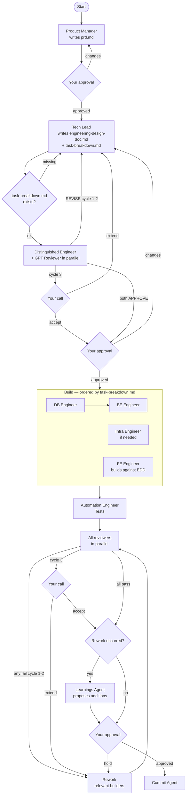
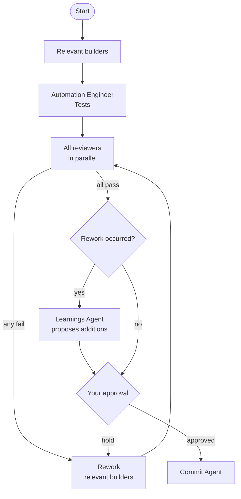

# Velo — Workflow

## `/velo:new` — New features

Structured workflow with mandatory planning and approval gates before any code is written.

## `/velo:task` — Day-to-day tasks

Lightweight path for bug fixes, refactors, and small changes. No planning phase.

## Learning loop

After any rework cycle, the Learnings Agent extracts codebase-specific patterns from reviewer findings and proposes additions to `.velo/learnings/`. You approve before anything is written. The team gets better with every task.
