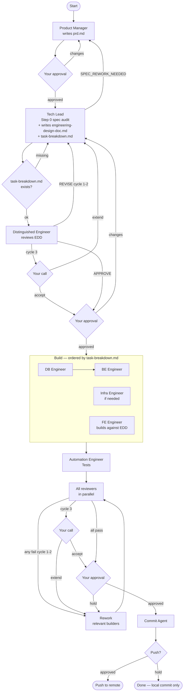
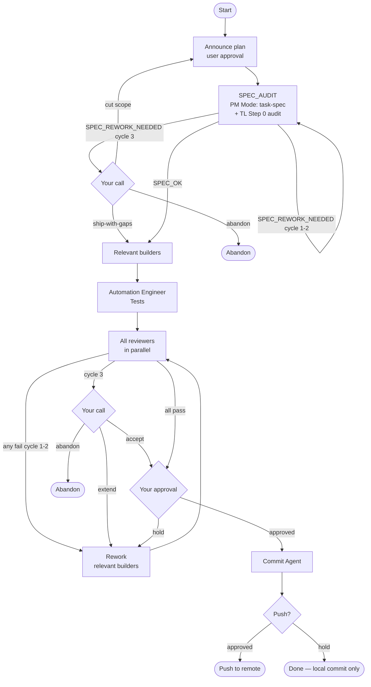
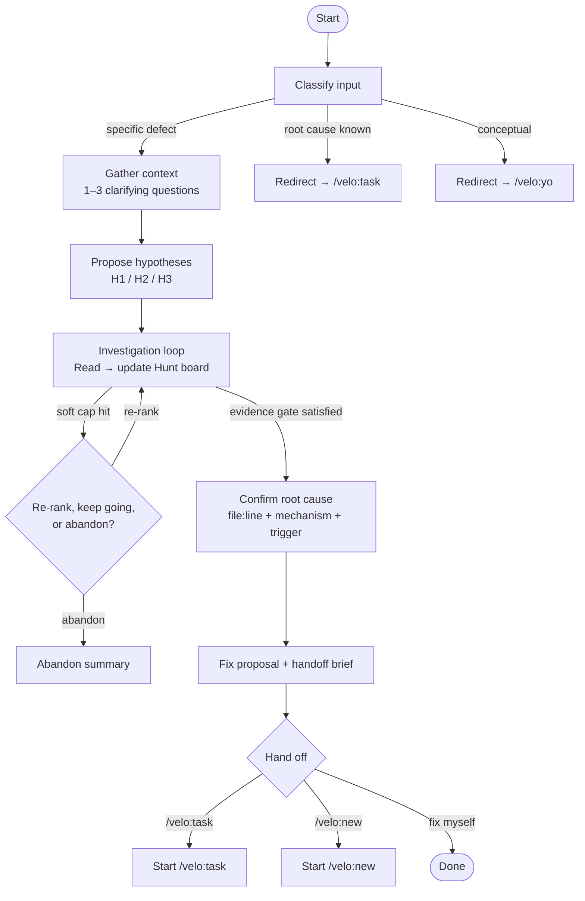

# Velo — Workflow

## `/velo:new` — New features

Structured workflow with mandatory planning and approval gates before any code is written.

## `/velo:task` — Day-to-day tasks

Lightweight path for bug fixes, refactors, and small changes. No planning phase.

## `/velo:hunt` — Structured debug loop

Symptom → hypothesis → root cause → handoff. No planning phase, no code written. Hunt ends with a confirmed root cause and a prose handoff brief, then routes to `/velo:task` (or `/velo:new` for infra/schema fixes).

> **Operator note**: Hunt reads source files and git history. Bash is constrained to `git log`/`git blame` — verify your `settings.json` allowlist before use on sensitive repos.

