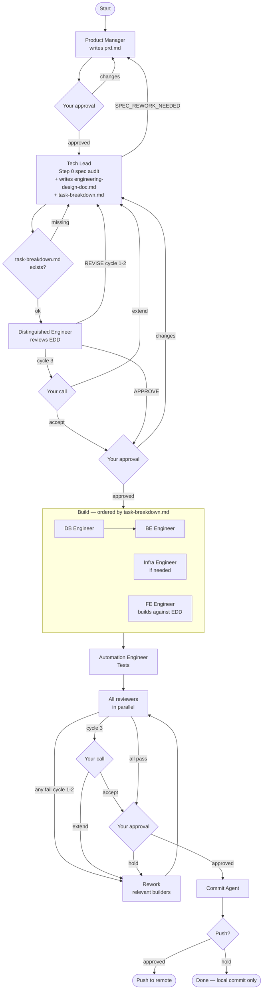
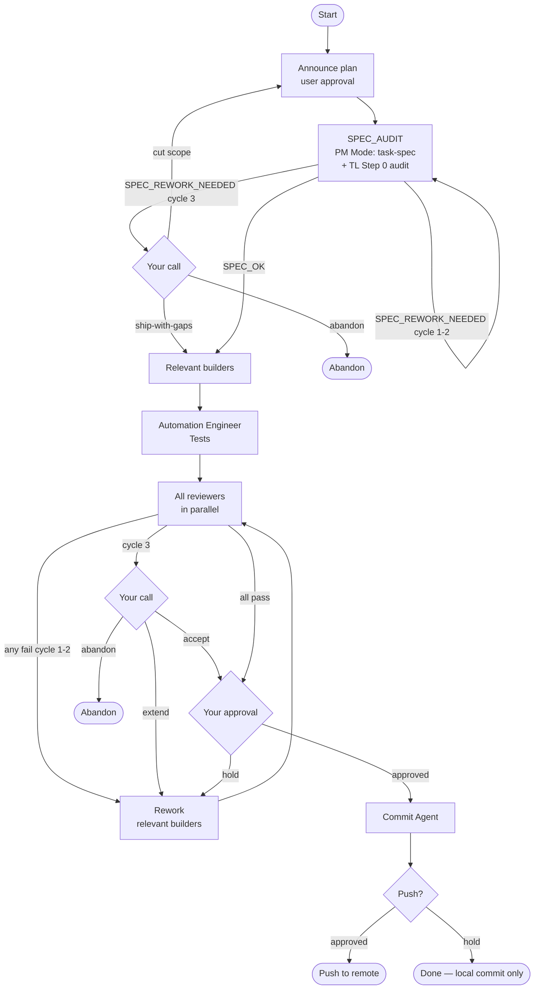
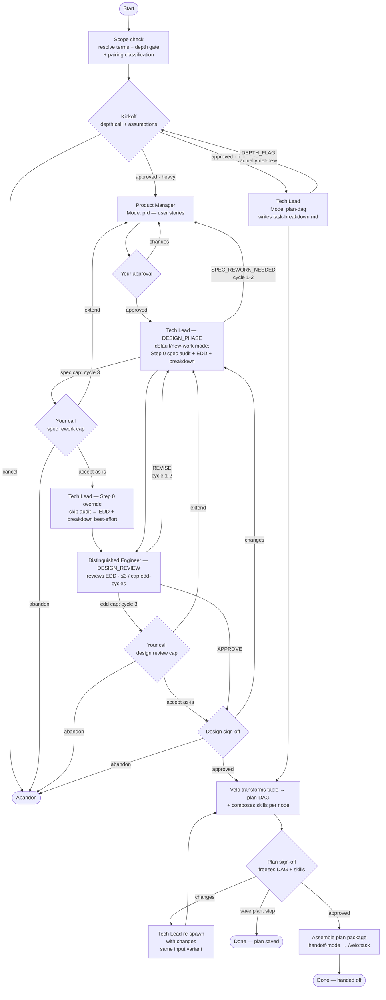
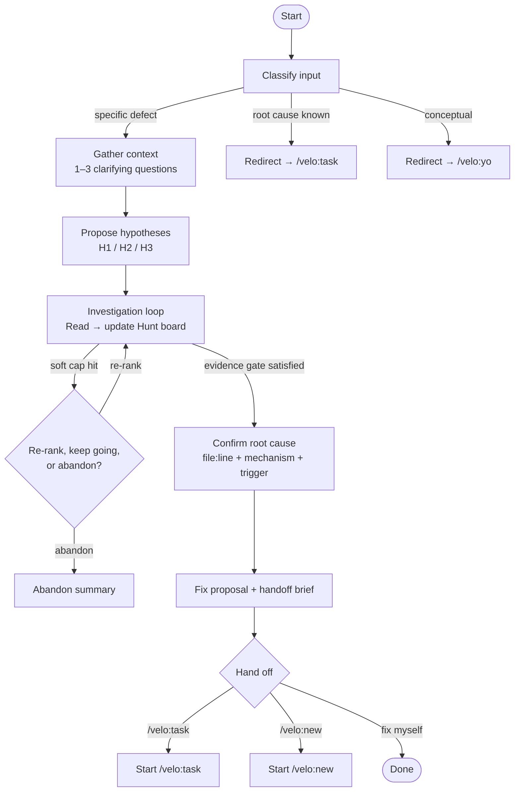

# Velo — Workflow

## `/velo:new` — New features

Structured workflow with mandatory planning and approval gates before any code is written.

```mermaid
flowchart TD
    A([Start]) --> PM[Product Manager\nwrites prd.md]
    PM --> A1{Your approval}
    A1 -->|changes| PM
    A1 -->|approved| TL[Tech Lead\nStep 0 spec audit\n+ writes engineering-design-doc.md\n+ task-breakdown.md]
    TL -->|SPEC_REWORK_NEEDED| PM
    TL --> TLV{task-breakdown.md\nexists?}
    TLV -->|missing| TL
    TLV -->|ok| REV[Distinguished Engineer\nreviews EDD]
    REV -->|REVISE cycle 1-2| TL
    REV -->|cycle 3| A2C{Your call}
    A2C -->|extend| TL
    A2C -->|accept| A2{Your approval}
    REV -->|APPROVE| A2{Your approval}
    A2 -->|changes| TL
    A2 -->|approved| BUILD

    subgraph BUILD [Build — ordered by task-breakdown.md]
        direction LR
        DB[DB Engineer] --> BE[BE Engineer]
        INF[Infra Engineer\nif needed]
        FE[FE Engineer\nbuilds against EDD]
    end

    BUILD --> TEST[Automation Engineer\nTests]
    TEST --> REVIEW[All reviewers\nin parallel]
    REVIEW -->|any fail cycle 1-2| REWORK[Rework\nrelevant builders]
    REWORK --> REVIEW
    REVIEW -->|cycle 3| A3C{Your call}
    A3C -->|extend| REWORK
    A3C -->|accept| A3{Your approval}
    REVIEW -->|all pass| A3{Your approval}
    A3 -->|approved| COMMIT[Commit Agent]
    A3 -->|hold| REWORK
    COMMIT --> A4{Push?}
    A4 -->|approved| PUSH([Push to remote])
    A4 -->|hold| DONE1([Done — local commit only])
```

## `/velo:task` — Day-to-day tasks

Lightweight path for bug fixes, refactors, and small changes. No planning phase.

```mermaid
flowchart TD
    A([Start]) --> ANN[Announce plan\nuser approval]
    ANN --> SA[SPEC_AUDIT\nPM Mode: task-spec\n+ TL Step 0 audit]
    SA -->|SPEC_REWORK_NEEDED cycle 1-2| SA
    SA -->|SPEC_REWORK_NEEDED cycle 3| A0S{Your call}
    A0S -->|ship-with-gaps| BUILD
    A0S -->|cut scope| ANN
    A0S -->|abandon| ENDS([Abandon])
    SA -->|SPEC_OK| BUILD[Relevant builders]
    BUILD --> TEST[Automation Engineer\nTests]
    TEST --> REVIEW[All reviewers\nin parallel]
    REVIEW -->|any fail cycle 1-2| REWORK[Rework\nrelevant builders]
    REWORK --> REVIEW
    REVIEW -->|cycle 3| A0C{Your call}
    A0C -->|extend| REWORK
    A0C -->|accept| A1{Your approval}
    A0C -->|abandon| END0([Abandon])
    REVIEW -->|all pass| A1{Your approval}
    A1 -->|approved| COMMIT[Commit Agent]
    A1 -->|hold| REWORK
    COMMIT --> A2{Push?}
    A2 -->|approved| PUSH([Push to remote])
    A2 -->|hold| DONE0([Done — local commit only])
```

## `/velo:plan` — Unified planning front-end

Adaptive planning that hands off to `/velo:task` for execution. Depth is gated: when the work is net-new, conflicted, or can't be reduced to a confirmable assumptions ledger (the three triggers shared with task.md's escalation rule), the heavy path fires — the PM writes user stories first, then the Tech Lead authors an engineering design doc that the Distinguished Engineer reviews (≤3 cycles) before you sign off on the design; otherwise the light path goes straight to the Tech Lead's breakdown (no PM, no EDD). The DE-reviewed EDD is a heavy-path artifact only — the light path carries no EDD. The TL breakdown runs **always** and becomes the plan-DAG (with skills composed per `velo-skill-composition`), frozen at your plan sign-off and carried in a plan package (`velo-plan-package`). No build — execution is `/velo:task`'s job.

> **Transition note (increment 1)**: `/velo:plan` coexists with `/velo:new` and `/velo:task`. Stock `/velo:task` does not yet consume the plan package as binding — it will re-announce the plan with its own gate. Executor-side consumption (and descope-as-reentry back into plan mode) lands in increment 2.

```mermaid
flowchart TD
    A([Start]) --> V[Scope check\nresolve terms + depth gate\n+ pairing classification]
    V --> ANN{Kickoff\ndepth call + assumptions}
    ANN -->|cancel| ABANDON([Abandon])
    ANN -->|approved · heavy| PM[Product Manager\nMode: prd — user stories]
    ANN -->|approved · light| TL[Tech Lead\nMode: plan-dag\nwrites task-breakdown.md]
    PM --> PR{Your approval}
    PR -->|changes| PM
    PR -->|approved| DP[Tech Lead — DESIGN_PHASE\ndefault/new-work mode:\nStep 0 spec audit + EDD + breakdown]
    DP -->|SPEC_REWORK_NEEDED\ncycle 1-2| PM
    DP -->|spec cap: cycle 3| SCAP{Your call\nspec rework cap}
    SCAP -->|extend| PM
    SCAP -->|accept as-is| TLO[Tech Lead — Step 0 override\nskip audit → EDD + breakdown best-effort]
    SCAP -->|abandon| ABANDON
    TLO --> DR
    DP --> DR[Distinguished Engineer — DESIGN_REVIEW\nreviews EDD · ≤3 / cap:edd-cycles]
    DR -->|REVISE\ncycle 1-2| DP
    DR -->|edd cap: cycle 3| ECAP{Your call\ndesign review cap}
    ECAP -->|extend| DP
    ECAP -->|accept as-is| DA
    ECAP -->|abandon| ABANDON
    DR -->|APPROVE| DA{Design sign-off}
    DA -->|changes| DP
    DA -->|abandon| ABANDON
    DA -->|approved| DAG
    TL -->|DEPTH_FLAG\nactually net-new| ANN
    TL --> DAG[Velo transforms table → plan-DAG\n+ composes skills per node]
    DAG --> PA{Plan sign-off\nfreezes DAG + skills}
    PA -->|changes| TLR[Tech Lead re-spawn\nwith changes\nsame input variant]
    TLR --> DAG
    PA -->|save plan, stop| DONE([Done — plan saved])
    PA -->|approved| HAND[Assemble plan package\nhandoff-mode → /velo:task]
    HAND --> DONE2([Done — handed off])
```

## `/velo:hunt` — Structured debug loop

Symptom → hypothesis → root cause → handoff. No planning phase, no code written. Hunt ends with a confirmed root cause and a prose handoff brief, then routes to `/velo:task` (or `/velo:new` for infra/schema fixes).

> **Operator note**: Hunt reads source files and git history. Bash is constrained to `git log`/`git blame` — verify your `settings.json` allowlist before use on sensitive repos.

```mermaid
flowchart TD
    A([Start]) --> CL[Classify input]
    CL -->|specific defect| CTX[Gather context\n1–3 clarifying questions]
    CL -->|root cause known| TASK[Redirect → /velo:task]
    CL -->|conceptual| YO[Redirect → /velo:yo]
    CTX --> HYP[Propose hypotheses\nH1 / H2 / H3]
    HYP --> LOOP[Investigation loop\nRead → update Hunt board]
    LOOP -->|soft cap hit| ASK{Re-rank, keep going,\nor abandon?}
    ASK -->|re-rank| LOOP
    ASK -->|abandon| ABANDON[Abandon summary]
    LOOP -->|evidence gate satisfied| RC[Confirm root cause\nfile:line + mechanism + trigger]
    RC --> FIX[Fix proposal + handoff brief]
    FIX --> HAND{Hand off}
    HAND -->|/velo:task| TASK2[Start /velo:task]
    HAND -->|/velo:new| NEW[Start /velo:new]
    HAND -->|fix myself| DONE([Done])
```
