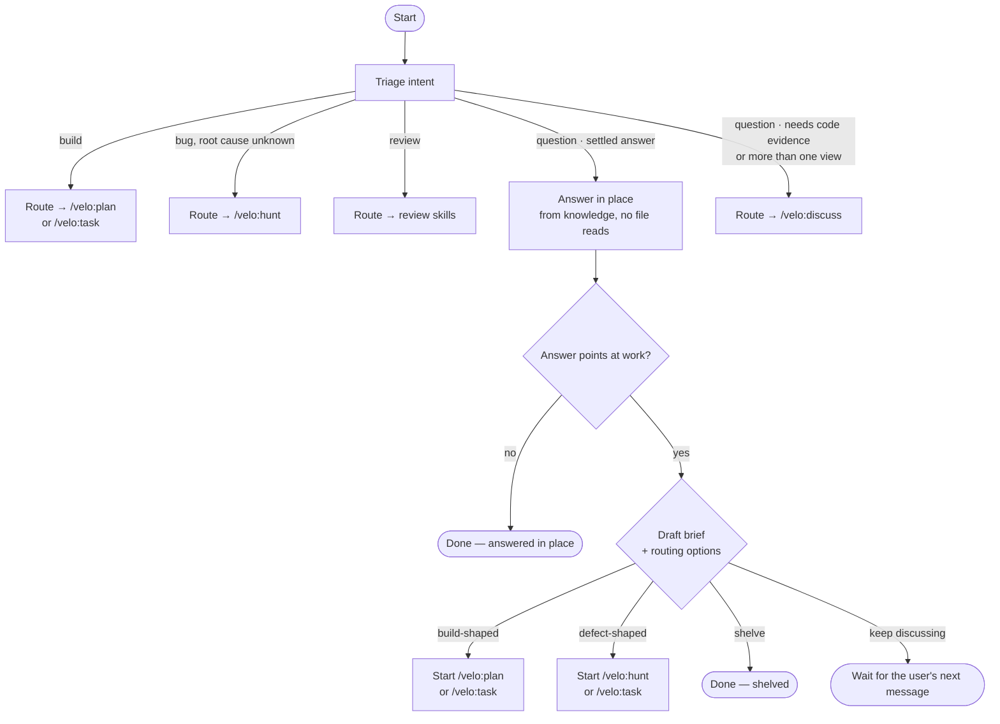
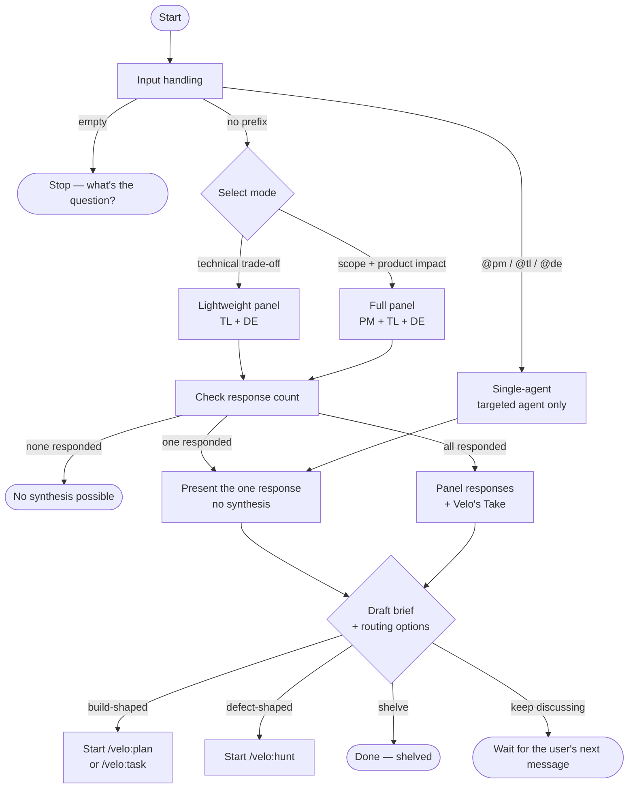
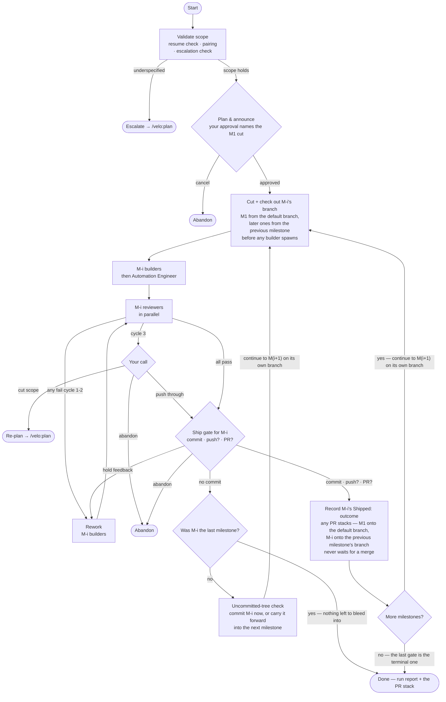
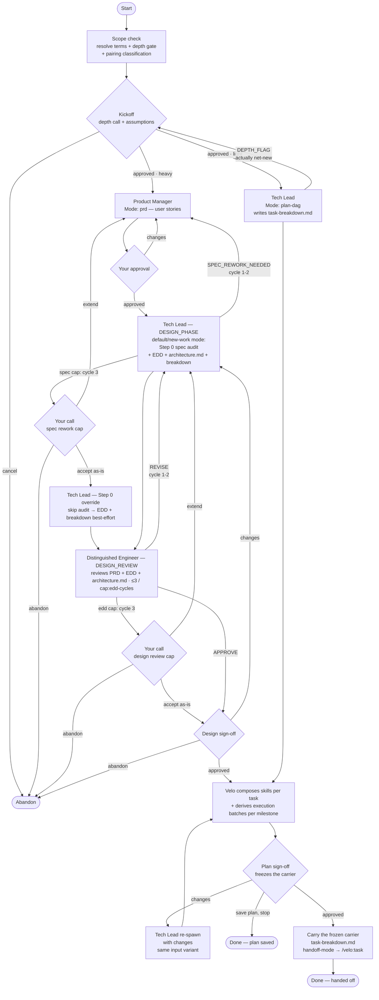
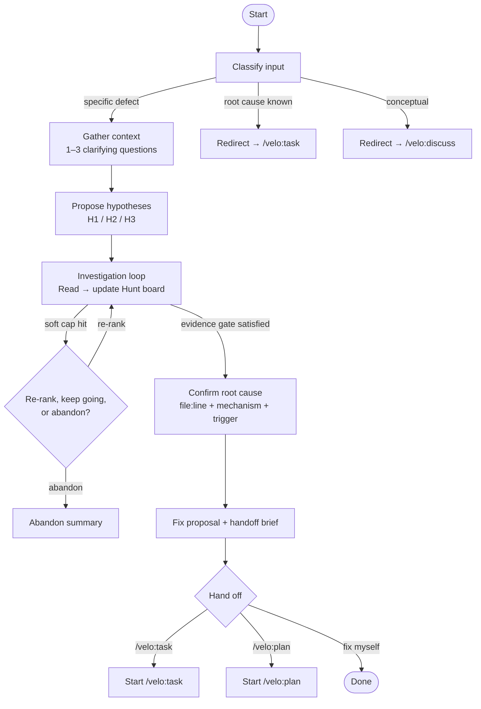

# Velo — Workflow

## `/velo:yo` — Entry point

The front door. Yo triages the intent of any request and routes it: build requests to `/velo:plan` or `/velo:task`, bugs to `/velo:hunt`, reviews to the review skills, questions worth more than one perspective to `/velo:discuss`. A question with a settled answer Velo can give from knowledge alone is answered in place — no file reads; if answering would need the codebase, it routes to `/velo:discuss` instead so the panel agents do the reading. An answer that lands on something to do hands off into a mode with a draft brief. Yo never does the work itself; the work happens in the mode it routes to. It is a front door, not a gate — every mode remains directly invokable.

```mermaid
flowchart TD
    A([Start]) --> T[Triage intent]
    T -->|build| P[Route → /velo:plan\nor /velo:task]
    T -->|bug, root cause unknown| H[Route → /velo:hunt]
    T -->|review| R[Route → review skills]
    T -->|question · settled answer| M[Answer in place\nfrom knowledge, no file reads]
    T -->|question · needs code evidence\nor more than one view| DIS[Route → /velo:discuss]
    M --> D{Answer points at work?}
    D -->|no| DONE0([Done — answered in place])
    D -->|yes| HB{Draft brief\n+ routing options}
    HB -->|build-shaped| PB[Start /velo:plan\nor /velo:task]
    HB -->|defect-shaped| HD[Start /velo:hunt\nor /velo:task]
    HB -->|shelve| DONE([Done — shelved])
    HB -->|keep discussing| WAIT([Wait for the user's next message])
```

## `/velo:discuss` — Advisory discussion

Bring a question, a trade-off, or a decision you're stuck on. Velo convenes the advisory panel — TL + DE for a technical trade-off, PM + TL + DE when scope and product impact are in play — then synthesizes the positions, classifies the agreement pattern, and picks a side rather than averaging. Prefix `@pm`, `@tl`, or `@de` to bypass mode selection and target one agent. The panel agents read the codebase; Velo does not. Advisory only — no code written, no artifact touched — and a discussion that lands on a decision hands off into a mode with a draft brief.

```mermaid
flowchart TD
    A([Start]) --> IN[Input handling]
    IN -->|empty| ASK([Stop — what's the question?])
    IN -->|"@pm" / @tl / @de| SA[Single-agent\ntargeted agent only]
    IN -->|no prefix| MS{Select mode}
    MS -->|technical trade-off| LW[Lightweight panel\nTL + DE]
    MS -->|scope + product impact| FP[Full panel\nPM + TL + DE]
    LW --> RC[Check response count]
    FP --> RC
    RC -->|none responded| FAIL([No synthesis possible])
    RC -->|one responded| PRES[Present the one response\nno synthesis]
    RC -->|all responded| SYN[Panel responses\n+ Velo's Take]
    SA --> PRES
    PRES --> HB{Draft brief\n+ routing options}
    SYN --> HB
    HB -->|build-shaped| P[Start /velo:plan\nor /velo:task]
    HB -->|defect-shaped| H[Start /velo:hunt]
    HB -->|shelve| DONE([Done — shelved])
    HB -->|keep discussing| WAIT([Wait for the user's next message])
```

## `/velo:task` — Day-to-day tasks

A single adaptive delegated flow for bug fixes, refactors, and small changes. Task self-plans: after validating scope, Velo announces the plan (builders, order, scope) for your approval, then builds. There is no spec sub-system — underspecified work escalates to `/velo:plan`; a carrier arriving *from* `/velo:plan` suppresses that escalation and is consumed as binding (no re-partition, no re-composition). Task mode writes no PRD or EDD — its only durable artifact is the same carrier, `task-breakdown.md`.

The build half is a **per-milestone loop**. `Build → Review → Ship gate` runs once per `## M1..Mn` milestone in carrier order:

- **Branch cut at milestone entry** — entering a milestone, Velo cuts and checks out `<slug>-m<i>` *before any builder spawns*. M1 cuts from the repo's default branch; each later milestone cuts from the previous milestone's branch, pushed or not.
- **Milestone-scoped build and review** — no task in M(i+1) starts until M(i)'s review cycle passes and its ship gate resolves. Rework cycles and execution batches are scoped to the milestone; the review counter restarts at each one.
- **A ship gate per milestone** — only the *last* milestone's gate is terminal. Every earlier resolution returns to the loop, and its own option label names the next branch cut (per-action authorization, no extra prompt). Each milestone's outcome is recorded on its `Shipped:` line. A gate that resolves *without* a commit gets one extra uncommitted-tree check before the next milestone opens — on the last milestone there is no next milestone to bleed into, so it goes straight to the terminal report.
- **Stacked PRs** — M1's PR targets the default branch, M(i)'s targets `<slug>-m<i-1>`. One stack, and the executor never waits for a merge.

A task-mode-native run emits a single `## M1` holding the whole DAG, so the loop runs exactly once — `n = 1` is the ordinary case, not a special case.

```mermaid
flowchart TD
    A([Start]) --> V[Validate scope\nresume check · pairing\n· escalation check]
    V -->|underspecified| ESC([Escalate → /velo:plan])
    V -->|scope holds| ANN{Plan & announce\nyour approval names the M1 cut}
    ANN -->|cancel| ENDS([Abandon])
    ANN -->|approved| CUT[Cut + check out M-i's branch\nM1 from the default branch,\nlater ones from the previous milestone\nbefore any builder spawns]
    CUT --> BUILD[M-i builders\nthen Automation Engineer]
    BUILD --> REVIEW[M-i reviewers\nin parallel]
    REVIEW -->|any fail cycle 1-2| REWORK[Rework\nM-i builders]
    REWORK --> REVIEW
    REVIEW -->|cycle 3| A0C{Your call}
    A0C -->|cut scope| REPLAN([Re-plan → /velo:plan])
    A0C -->|push through| SG
    A0C -->|abandon| END0([Abandon])
    REVIEW -->|all pass| SG{Ship gate for M-i\ncommit · push? · PR?}
    SG -->|hold feedback| REWORK
    SG -->|abandon| END0
    SG -->|commit · push? · PR?| SHIP[Record M-i's Shipped: outcome\nany PR stacks — M1 onto the default branch,\nM-i onto the previous milestone's branch\nnever waits for a merge]
    SG -->|no commit| NCLAST{Was M-i the last milestone?}
    NCLAST -->|"yes — nothing left to bleed into"| DONE0([Done — run report + the PR stack])
    NCLAST -->|no| CARRY[Uncommitted-tree check\ncommit M-i now, or carry it forward\ninto the next milestone]
    CARRY -->|"continue to M(i+1) on its own branch"| CUT
    SHIP --> MORE{More milestones?}
    MORE -->|"yes — continue to M(i+1) on its own branch"| CUT
    MORE -->|"no — the last gate is the terminal one"| DONE0
```

## `/velo:plan` — Unified planning front-end

Adaptive planning that hands off to `/velo:task` for execution. Depth is gated: when the work is net-new, conflicted, or can't be reduced to a confirmable assumptions ledger (the three triggers shared with task.md's escalation rule), the heavy path fires — the PM writes user stories first, then the Tech Lead authors an engineering design doc that the Distinguished Engineer reviews (≤3 cycles) before you sign off on the design; otherwise the light path goes straight to the Tech Lead's breakdown (no PM, no EDD). The heavy path produces `prd.md`, `engineering-design-doc.md`, `architecture.md` (a constrained mermaid shape diagram the DE reads alongside the EDD), and the carrier `task-breakdown.md`; the light path produces the carrier alone. The TL breakdown runs **always** and becomes the milestone body of the carrier (with skills composed per `velo-skill-composition`), frozen at your plan sign-off — one durable file per task, specified in `velo-task-status.md`. No build — execution is `/velo:task`'s job.

> **Handoff note**: `/velo:task` re-validates and re-announces the plan with its own gate — approve it there too. Consumption of the frozen carrier is binding: task mode does not re-partition the milestones or re-compose the skills, and the `Planned-via` header keeps a planned run from re-escalating back to `/velo:plan`. A mid-build descope that resolves to `Cut scope` re-enters plan mode with the carrier's `Task-folder`.

```mermaid
flowchart TD
    A([Start]) --> V[Scope check\nresolve terms + depth gate\n+ pairing classification]
    V --> ANN{Kickoff\ndepth call + assumptions}
    ANN -->|cancel| ABANDON([Abandon])
    ANN -->|approved · heavy| PM[Product Manager\nMode: prd — user stories]
    ANN -->|approved · light| TL[Tech Lead\nMode: plan-dag\nwrites task-breakdown.md]
    PM --> PR{Your approval}
    PR -->|changes| PM
    PR -->|approved| DP[Tech Lead — DESIGN_PHASE\ndefault/new-work mode:\nStep 0 spec audit\n+ EDD + architecture.md + breakdown]
    DP -->|SPEC_REWORK_NEEDED\ncycle 1-2| PM
    DP -->|spec cap: cycle 3| SCAP{Your call\nspec rework cap}
    SCAP -->|extend| PM
    SCAP -->|accept as-is| TLO[Tech Lead — Step 0 override\nskip audit → EDD + breakdown best-effort]
    SCAP -->|abandon| ABANDON
    TLO --> DR
    DP --> DR[Distinguished Engineer — DESIGN_REVIEW\nreviews PRD + EDD + architecture.md · ≤3 / cap:edd-cycles]
    DR -->|REVISE\ncycle 1-2| DP
    DR -->|edd cap: cycle 3| ECAP{Your call\ndesign review cap}
    ECAP -->|extend| DP
    ECAP -->|accept as-is| DA
    ECAP -->|abandon| ABANDON
    DR -->|APPROVE| DA{Design sign-off}
    DA -->|changes| DP
    DA -->|abandon| ABANDON
    DA -->|approved| DAG
    TL -->|DEPTH_FLAG\nactually net-new| ANN
    TL --> DAG[Velo composes skills per task\n+ derives execution batches per milestone]
    DAG --> PA{Plan sign-off\nfreezes the carrier}
    PA -->|changes| TLR[Tech Lead re-spawn\nwith changes\nsame input variant]
    TLR --> DAG
    PA -->|save plan, stop| DONE([Done — plan saved])
    PA -->|approved| HAND[Carry the frozen carrier\ntask-breakdown.md\nhandoff-mode → /velo:task]
    HAND --> DONE2([Done — handed off])
```

## `/velo:hunt` — Structured debug loop

Symptom → hypothesis → root cause → handoff. No planning phase, no code written. Hunt ends with a confirmed root cause and a prose handoff brief, then routes to `/velo:task` (or `/velo:plan` for infra/schema fixes that need planning first).

> **Operator note**: Hunt reads source files and git history. Bash is constrained to `git log`/`git blame` — verify your `settings.json` allowlist before use on sensitive repos.

```mermaid
flowchart TD
    A([Start]) --> CL[Classify input]
    CL -->|specific defect| CTX[Gather context\n1–3 clarifying questions]
    CL -->|root cause known| TASK[Redirect → /velo:task]
    CL -->|conceptual| DISC[Redirect → /velo:discuss]
    CTX --> HYP[Propose hypotheses\nH1 / H2 / H3]
    HYP --> LOOP[Investigation loop\nRead → update Hunt board]
    LOOP -->|soft cap hit| ASK{Re-rank, keep going,\nor abandon?}
    ASK -->|re-rank| LOOP
    ASK -->|abandon| ABANDON[Abandon summary]
    LOOP -->|evidence gate satisfied| RC[Confirm root cause\nfile:line + mechanism + trigger]
    RC --> FIX[Fix proposal + handoff brief]
    FIX --> HAND{Hand off}
    HAND -->|/velo:task| TASK2[Start /velo:task]
    HAND -->|/velo:plan| NEW[Start /velo:plan]
    HAND -->|fix myself| DONE([Done])
```
