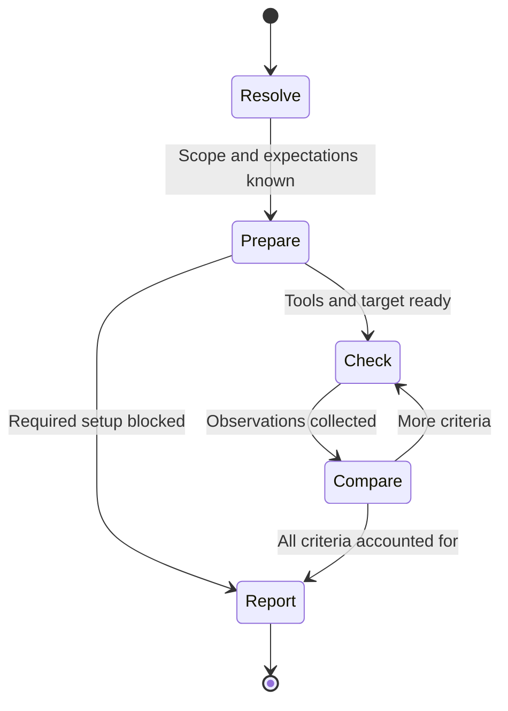

# Velo — Verify

Verify answers whether the current implementation meets the requested acceptance criteria. It reads requirements and code, runs relevant checks, and returns an evidence report. It may be called directly or by Run as part of a milestone gate.

## Scope

- Source code, plan text, approval, progress marks, and Git history are read-only. Do not fix code, write new test suites, change expected results, switch branches, commit, push, merge, or open PRs.
- Starting a known local development server and running existing tests, builds, or checks are permitted when needed for the requested verification. Use non-fixing commands; do not update snapshots, reformat source, install dependencies, or change browser/MCP configuration implicitly. Ordinary build output is allowed; preserve unrelated changes and do not clean them up.
- Use the authorized test target and fixtures. State-changing UI/API checks must stay within the authorized scenario and test data. Production writes and real external actions require explicit authorization.
- Report in the conversation by default. Screenshots or other evidence files may be saved only to an authorized output location. Do not create another plan or report file by default. When called by Run, return results; Run owns its event log and progress writes.
- Verify does not replace Run's independent review gate. Running this playbook in the builder's own flow does not make verification independent review.

## Workflow

### 1. Resolve expectations

Accept a plan slug/path with optional milestone or AC ids, or explicit acceptance criteria with a target and setup. Empty input asks what to verify and stops; a capability question needs no repository scan. Resolve an ambiguous plan or target before checking. Do not choose a plan unprompted.

For a plan, read Acceptance criteria and Verification; preserve ids, milestone ownership, cases, and expectations. Verify the specified subset, or all criteria if no subset was requested, and report the scope. If the plan lacks criteria, use checks explicitly stated in it; if neither exists, ask for expected behavior instead of inventing it. For ad hoc input, assign report-local AC ids without writing a plan.

Standalone verification does not require plan approval, since it performs no implementation. Clearly label results against an unapproved plan as provisional. When called by Run, the caller must supply the exact approved plan version and milestone; require matching approval before accepting that gate request. Standalone results never freeze a plan, authorize Run, or mark a milestone complete.

### 2. Prepare

Read the setup, target, test data, and expected result for each check. Confirm tools are available and the app serves the intended implementation. Record plan version (if any), commit and local-change state, target, provider, and time. If the implementation cannot be identified reliably, return blocked for affected criteria rather than verifying a different deployment.

For browser criteria, load [browser-verification.md](../.agents/skills/verify/references/browser-verification.md). For API/command checks, use the specified endpoint or existing project commands and compare actual results. For manual checks, require attributed user confirmation or supplied evidence; do not pretend the agent executed them.

### 3. Check and compare

Execute all requested cases for each criterion. Collect the actions/inputs, expected result, actual result, and evidence. Use the method that proves the claim; UI success alone does not establish backend persistence or authorization. Continue independent checks when one is blocked or fails and doing so remains meaningful. Stop a dependent sequence if its prerequisite fails; account for remaining checks as blocked.

Per criterion: `pass` means every required case was observed to match; `fail` means at least one observed mismatch; `blocked` means no mismatch was established but required verification could not be completed. If one case fails and another is blocked, the criterion fails and the report also names the unexecuted case. No missing check counts as a pass.

### 4. Report and return

Start with overall `pass`, `fail`, or `blocked`. Overall pass requires every requested criterion to pass; any observed failure makes the result fail; otherwise incomplete verification makes it blocked. A subset pass is only a pass for that subset, never the whole feature. Include scope, version/revision, target, provider, timestamp, and a table:

| Criterion | Result | Actions / inputs | Expected | Observed | Evidence / blocker |
|---|---|---|---|---|---|
| AC1 | pass / fail / blocked | Cases actually performed | Required behavior | Actual values or missing prerequisite | Concrete observations or evidence reference |

Name unexecuted cases and the next action required for each failure/blocker. Redact credentials and secrets. Keep evidence tied to the implementation actually checked; later relevant edits invalidate the affected pass.

When standalone, return the report and stop. When called by Run, return the same structured evidence to Run; Run appends Verification event bullets, handles rework or a pause, and re-invokes Verify after relevant fixes. Verify itself never repairs code, weakens criteria, or starts another mode. No extra approval is needed just to return to an already-authorized Run caller.

## Task

$ARGUMENTS
