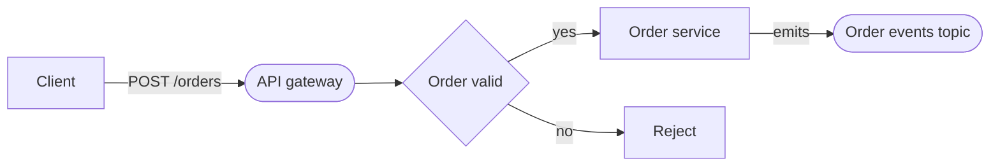

# Velo Task Status

## Purpose

One durable file per task carries the plan, the handoff contract, and the live status together, so they cannot drift apart. Two plain-markdown files, both written by Velo (the orchestrator) — never by spawned agents:

- `.velo/tasks/<slug>/task-breakdown.md` — **the carrier**. A Velo-owned header region (frozen keys, brief, confirmed ledger, constraints, artifacts) followed by a Tech-Lead-owned milestone body whose task lines carry live `Status`. It is the resume breadcrumb, the plan, and the plan→task handoff contract in one file.
- `.velo/tasks/index.md` — global task index, one row per task. `index.md` is a file and task slugs are directories, so no slug can collide with it.

Heavy-path siblings live beside the carrier and are referenced from its `## Artifacts` line: `prd.md`, `engineering-design-doc.md`, and `architecture.md` (format and mermaid allow-list specified below). The retired status breadcrumb, plan package, and product-marker files are gone — every load-bearing contract they carried lives here.

**Deliberately NOT an engine.** A prior heavy state system (JS state machine, `state.json`, CLI tracker, 107 tests) was rolled back as over-engineered. This skill is the replacement philosophy: markdown Velo rewrites at transitions. No schema validation, no parser, no code, no CLI, no tests, no JSON. All writes are full-file rewrites by Velo; solo-user, serial workflow — last write wins, no locking, no concurrency machinery. If a breadcrumb is missing or unparseable, Velo degrades gracefully — proceed as new work; never block on a breadcrumb.

## Phase names

The carrier records both the technical state ID (structure, executor dispatch) and the friendly team name (everything the user reads), per each command's narration convention. Plan-mode names come from `commands/plan.md`; task-mode names are defined here (task.md narrates work, not states, so these appear only in the carrier and resume prompts):

| Mode | Technical ID | Team name |
|---|---|---|
| plan | VALIDATE | Scope check |
| plan | ANNOUNCE | Kickoff |
| plan | PM_PHASE | Product framing |
| plan | PRD_REVIEW | Framing review |
| plan | DESIGN_PHASE | Design doc |
| plan | DESIGN_REVIEW | Design review |
| plan | DESIGN_APPROVAL | Design sign-off |
| plan | DAG_PHASE | Work planning |
| plan | PLAN_APPROVAL | Plan sign-off |
| plan | HANDOFF | Hand to the builders |
| task | VALIDATE | Scope check |
| task | PLAN_AND_ANNOUNCE | Plan & kickoff |
| task | BUILD | Build |
| task | REVIEW | Review |
| task | SHIP_GATE | Ship gate |
| both | DONE | Done |
| both | ABANDON | Abandoned |

## Carrier format — `task-breakdown.md`

Velo-owned region first (keys, then sections), TL-owned milestones after. Literal skeleton:

```markdown
# Task Breakdown — <slug>

- Planned-via: /velo:plan | —              ← — for task-mode-native runs; suppression key, verbatim
- Task-folder: .velo/tasks/<slug>/
- Mode: plan | task                        ← resume dispatch key
- Product: <product-slug> | —              ← Velo writes: after PM_PHASE (plan); at carrier creation in PLAN_AND_ANNOUNCE (task-native)
- Depth: heavy (trigger <1|2|3>) | light | —
- Pairing: product | pure-tech
- Branch-convention: <slug>-m<i> | —       ← set once at PLAN_AND_ANNOUNCE; resumed runs derive identical names
- Phase: <TECHNICAL_ID> (<team name> — M<i> of <n>)   ← e.g. BUILD (Build — M2 of 3); the milestone suffix is
                                             present only while a milestone is in flight (task BUILD/REVIEW/
                                             SHIP_GATE); terminal: DONE/ABANDON (… — <terminal reason>)
- Last gate passed: <TECHNICAL_ID> (<team name>) | —   ← same milestone suffix when the gate was a per-milestone SHIP_GATE
- Rework cycles: spec <n> · edd <n> · review <n>
- Re-entry: descope (<F-code>) | —         ← descope re-entry anchor
- Updated: <output of `date '+%Y-%m-%d %H:%M'`>
- Summary: <one line — same line as the index row>

## Brief (verbatim)
<the original user brief, unedited — written into the ANNOUNCE-entry stub>

## Assumptions (confirmed)
- <term> → <interpretation/signal>         ← proposed entries present from the stub, marked "(pending kickoff approval)"; marker cleared at kickoff approval

## Constraints/notes                       ← every entry is a `- ` bullet or "(none)"; never a heading
<F5 notes, dropped-skill flags, F2-override advisories, header-repair notes, or "(none)">

## Artifacts                               ← THE SEAM ANCHOR: last Velo-owned section, present from the stub
prd.md, engineering-design-doc.md, architecture.md   ← whichever exist ("—" until the PLAN_APPROVAL freeze
                                             fills it); heavy path only for the last two

## M1 — <milestone name>                   ← the seam: the first `## M` heading BELOW `## Artifacts`.
Branch: <slug>-m1 · Shipped: —                TL-owned from here down. Zero-task milestone = invalid
                                              output, same error class as a missing task-breakdown.md
- T1 · <agent> — <does> · skills: <slug>, +<addition> · needs: — · Status: pending
- T2 · <agent> — <does> · skills: <slug> · needs: T1 · Status: pending
Execution: batch 1 — T1; batch 2 — T2 after T1.    ← Velo-appended at the PLAN_APPROVAL freeze

## M2 — <milestone name>
Branch: <slug>-m2 · Shipped: —
- T3 · <agent> — <does> · skills: <slug> · needs: T2 · Status: pending
Execution: single node — no parallelism.
```

Grammar notes: the TL writes task lines WITHOUT `skills:` — Velo enriches them at the freeze per [Velo Skill Composition](velo-skill-composition.md) (composition is orchestrator-owned). `needs:` may reference tasks in earlier milestones. Task-line rendering otherwise follows [Velo Plan DAG](velo-plan-dag.md); `Execution:` batches follow [Velo Parallelism](velo-parallelism.md), derived within a milestone. Milestones are always present — a single-task plan is `## M1` with one task, never a flat, milestone-less table. A milestone with zero tasks is invalid TL output, the same error class as a missing `task-breakdown.md`: stop, name the fault, re-spawn.

**Timestamps**: always sourced from the shell — run `date '+%Y-%m-%d %H:%M'` (dates in index.md: `date '+%Y-%m-%d'`). Agents cannot generate reliable time; never invent a timestamp.

### Header key semantics

Do not rename or repurpose these keys — both commands' resume and handoff logic dispatches on them.

- **`Planned-via`** — the executor's dispatch key, verbatim `/velo:plan` on a planned run, `—` on a task-mode-native run. **Escalation suppression**: a carrier-bearing `/velo:task` invocation never re-escalates to `/velo:plan` — task.md's escalation Hard Rule carries an explicit `Planned-via` exception, because the work was already planned. Consumption is binding: task mode skips its own planning entirely (no re-partition, no re-composition — the frozen milestone body is authoritative).
- **`Task-folder`** — where the durable artifacts live, including the carrier itself. It is the anchor both commands' resume carve-outs dispatch on ("reuse its `Task-folder` silently") and the descope re-entry anchor; it must never be dropped from a handoff or handback payload, and a folder arriving on one is never suffix-slugged or abandoned.
- **`Mode`** — which command owns the run right now. The resume protocol dispatches on it for cross-mode handoff. Plan mode's handoff leaves the carrier at `Phase: HANDOFF`; task mode's first write flips `Mode:` to `task`.
- **`Product`** — the product slug, written by Velo from the PM's reported slug (this replaces the retired side-car product-marker file). `—` when the run has no product context.
- **`Depth`** — which path planning took and which trigger fired. Auditability only; the executor does not branch on it. The depth gate itself (three triggers, user override, `DEPTH_FLAG`) is unchanged and lives in the commands.
- **`Pairing`** — the product/pure-tech classification, carried so the executor's reviewer routing needs no re-derivation.
- **`Branch-convention`** — the milestone branch-name pattern, decided once at `PLAN_AND_ANNOUNCE` and recorded so a resumed run derives identical names. See Git strategy below.
- **`Phase`** / **`Last gate passed`** — technical ID + team name, per the Phase names table. **In task mode, while a milestone is in flight, the team name carries the milestone suffix `— M<i> of <n>`** — written exactly as `Phase: BUILD (Build — M2 of 3)`. It is rewritten on every transition through `BUILD`, `REVIEW`, and `SHIP_GATE`, advances when the next milestone is entered, and is what a resumed run reads to know which milestone body to re-enter (without it, `BUILD (Build)` is written identically whether the run died in M1, M2, or M3). States with no milestone in flight — every plan-mode state, task `VALIDATE`, task `PLAN_AND_ANNOUNCE` — carry no suffix. The terminal stamp keeps its own form: `DONE (Done — <terminal reason>)`. `Last gate passed:` follows the same convention when the gate it names was a per-milestone `SHIP_GATE`.
- **`Rework cycles`** — spec / edd / review counters.
- **`Re-entry`** — `descope (<F-code>)` while a descope re-plan is in flight, else `—`. See Descope re-entry below.
- **`Updated`** / **`Summary`** — `date`-sourced timestamp; the summary line is the same line as the index row.

### `Status` vocabulary

`pending | in-flight | done`, one per task line. Rework sends a task back to `in-flight`.

**A task whose `Status` reads `done` is complete and MUST NOT be re-run.** This is the retired plan package's `done:` node annotation, verbatim in meaning: one carrier now instead of two, but the same rule — done means complete, never re-run, whether the reader is a resume, a rework loop, or a descope re-plan. There is no separate `done:` annotation and no snapshot to derive; the carrier's per-task `Status` on disk is the record.

### The header-only stub

Created at plan `ANNOUNCE` entry, containing the header keys, `## Brief (verbatim)`, the PROPOSED assumptions ledger with each entry marked `(pending kickoff approval)`, and the two remaining Velo-owned section headings — `## Constraints/notes` and `## Artifacts`, both holding `—` until the `PLAN_APPROVAL` freeze fills them. No milestones, no body. It is **a named, valid state, not an error condition**: a carrier in this shape is resumable, and the resume protocol must treat it as such rather than as "file missing, degrade."

The empty `## Artifacts` heading is not decoration: it is the seam anchor (see Ownership boundary), and the TL returns a milestone body at `DESIGN_PHASE`/`DAG_PHASE` — before the freeze — so the anchor has to exist before the content it anchors.

The marker clears at kickoff approval: Velo rewrites the carrier with the ledger entries marked confirmed and `Depth`/`Pairing` final. A kill before that approval resumes from Kickoff and re-renders from the persisted brief plus the proposed entries — `VALIDATE`'s stop-and-ask answers are already folded into those entries, so nothing is lost.

## Ownership boundary

**The seam is the first `## M` heading below the `## Artifacts` line.** Velo owns everything above that heading — the header keys and the `Brief` / `Assumptions` / `Constraints/notes` / `Artifacts` sections. The Tech Lead writes only at and below it: the `## M1..Mn` milestone bodies, their `Branch:`/`Shipped:` metadata lines, and the task lines. Spawned agents never write the header region — the PM, DE, builders, and reviewers report to Velo, and Velo makes the edit.

**Why the scan starts at `## Artifacts` and not at the top of the file.** `## Brief (verbatim)` holds the user's brief unedited and unescaped, so a brief that pastes multi-phase planning notes can legitimately contain a line beginning `## M1 — …`. A first-`## M`-in-the-file scan would match *that* line — inside the Velo-owned region — and split the file above the header it was meant to protect, miscomputing the seam for the repair rule below and for every resume that reads the milestone body. `## Artifacts` is the last Velo-owned section and Velo is its only writer, so every free-text region a user or an agent can fill (`Brief`, `Assumptions`, `Constraints/notes`) sits above the anchor **by construction** and no pasted text can move the seam. The rule stays as mechanical and as grep-able as a bare first-`## M` scan — find `## Artifacts`, take the next `## M` — and survives partial writes the same way.

Three mechanical consequences:

- **The anchor always exists.** `## Artifacts` is created with the stub at `ANNOUNCE` entry (`—` until the freeze fills it), which is before any TL body arrives.
- **If more than one `## Artifacts` line is present, take the last.** Velo writes exactly one, below the Brief, so the last occurrence is always the real one; a `## Artifacts` line inside the milestone body is invalid TL output.
- **A carrier with no `## Artifacts` line at all** — damaged, or written before this convention — is a damaged Velo-owned region, not a licence to fall back to a top-of-file scan. Velo restores the section from the files actually present in the task folder (whichever of `prd.md`, `engineering-design-doc.md`, `architecture.md` exist), placing it directly below the last Velo-owned section heading present (`## Constraints/notes`, else `## Assumptions (confirmed)`, else `## Brief (verbatim)`), and then computes the seam.

`Constraints/notes` carries the same class of risk at lower probability — F5 notes and TL advisories are agent-composed, but an advisory can quote a user finding verbatim. It is covered by the same anchor (it sits above `## Artifacts`), and by one authoring rule: **every entry Velo writes into `Constraints/notes` is a `- ` bullet, or the literal `(none)`** — never a heading, and a quoted finding goes inline after the bullet.

**Validation and repair (runs after every TL return):**

1. Velo compares the region above the seam against the header it last wrote. Velo rewrites the file at every transition, so it holds the authoritative in-session copy.
2. On mismatch, Velo rewrites the header from that authoritative state — the on-disk header never wins over it. A missing or displaced `## Artifacts` line is a mismatch like any other.
3. Velo notes the repair in `Constraints/notes` (one `- ` bullet: what was clobbered, when).
4. Velo re-spawns the TL **only if the body is also invalid** — no `## M` heading below the anchor at all, a zero-task milestone, or task lines that cannot be read as task lines. A clobbered header with a sound body is a repair, not a re-spawn. (On resume there is no in-session copy and no TL in flight, so the same body fault resolves differently — see Body check before re-entry.)

Without this, a TL clobber followed by a session kill persists a corrupted header into resume dispatch — and `Mode:`/`Phase:` are exactly the resume protocol's detection keys.

## Git strategy

Recorded here once, as the single contract the executor implements:

> One stack. Each milestone on its own branch `<slug>-m<i>`, cut from `<slug>-m<i-1>` (M1 from the default branch). M(i)'s PR targets `<slug>-m<i-1>`; M1's PR targets the default branch. The executor never waits for a merge.

The branch name pattern is fixed at `PLAN_AND_ANNOUNCE` and recorded in `Branch-convention:` so a resumed run derives identical names. Each milestone's `Shipped:` line records that milestone's ship-gate outcome — the gate choice, the PR URL if one was opened, and a carry-forward note when the gate resolved without a commit. The per-milestone gate mechanics (cut point, no-commit re-prompt, base-on-remote check) live in `commands/task.md`; this section is the shape they must produce.

## index.md format

```markdown
# Velo — Task Index

Newest-first: new tasks are inserted directly below the header row. Maintained by Velo per velo-task-status.md.

| Task | Status | Created | Updated | Summary |
|---|---|---|---|---|
| [<slug>](<slug>/) | in-progress | 2026-07-20 | 2026-07-20 | <one-line title> |
```

- **Ordering**: newest-first — a new task's row is inserted directly below the header separator. Active work is what the index is scanned for.
- **Status vocabulary**: `in-progress | done | abandoned`.
- **Row lifecycle**: inserted at task-folder creation (`in-progress`); flipped to `done` when `/velo:task` reaches `DONE`, and to `abandoned` at either mode's `ABANDON`. Plan mode's `DONE` (`handed-off-to-task` or `plan-saved-no-handoff`) leaves the row `in-progress` — the index tracks the work item, not the planning session; planning finished but the work is live until the executor delivers it. Only the `Updated` date advances.

## Write points

| Event | task-breakdown.md (carrier) | index.md |
|---|---|---|
| plan `ANNOUNCE` entry | create stub: keys + `## Brief (verbatim)` + proposed ledger, marked pending + the `## Constraints/notes` and `## Artifacts` headings (`—` until the freeze; `## Artifacts` is the seam anchor) | insert row, `in-progress` |
| plan `ANNOUNCE` approval | rewrite: ledger entries marked confirmed; `Depth`/`Pairing` final | — |
| light→heavy late correction (`DEPTH_FLAG` accepted at re-entered kickoff) | header `Depth` flips; any light-path body draft is retained with a note in `Constraints/notes` — never silently discarded; `architecture.md` follows via the now-entered `DESIGN_PHASE` row | — |
| plan `PM_PHASE` return | Velo writes `Product:` key from PM's reported slug | — |
| plan `DESIGN_PHASE` (heavy) | TL writes milestone body below the seam + `architecture.md`; Velo validates the region above the seam intact + both files exist | — |
| plan `DAG_PHASE` (light) | TL writes milestone body below the seam; Velo validates the region above the seam intact | — |
| plan `PLAN_APPROVAL` freeze | Velo writes Constraints/Artifacts, `skills:` per task, `Execution:` per milestone (Brief already persisted at the stub) | — |
| every state transition (both modes) | rewrite header: Phase (carrying the in-flight `— M<i> of <n>` suffix in task mode), Last gate, counters, Updated | — |
| task `PLAN_AND_ANNOUNCE` | carried `Task-folder`: flip `Mode: task`, set `Branch-convention`; native run: create full carrier (header incl. `Product:` + body) | insert row if absent |
| task `BUILD` — milestone entry | header advances to `Phase: BUILD (Build — M<i> of <n>)` **first**, then Velo cuts + checks out `<slug>-m<i>` — the stamp is the only corroboration a later resume accepts for treating that branch as ours, so the record must precede the branch it authorizes; both precede any builder spawn | — |
| task `BUILD` (mirrors `track-tasks`) | task `Status` flips `pending → in-flight → done` | — |
| per-milestone `SHIP_GATE` | header `Phase: SHIP_GATE (Ship gate — M<i> of <n>)`; milestone line: `Shipped: <gate choice>` + PR URL if opened; carry-forward note on a no-commit resolution | — |
| `DONE` / `ABANDON` | terminal Phase stamp — handoff exception unchanged (stays `Phase: HANDOFF`) | flip status, advance Updated |

A rework cycle that loops *within* a state (`REVIEW`, `DESIGN_REVIEW`, the spec loop) bumps the matching `Rework cycles` counter and rewrites the header, even though no state boundary is crossed.

**Exception — plan handoff stays non-terminal**: plan mode's `DONE` via `handed-off-to-task` does NOT stamp a terminal Phase. The carrier stays at `Phase: HANDOFF (Hand to the builders)` so the carrier-bearing `/velo:task` invocation arrives at a non-terminal header; the executor's first write takes ownership (flipping `Mode:` to `task`). Only `plan-saved-no-handoff` stamps plan-mode `DONE` terminal. The index-row lifecycle is unchanged — the row stays `in-progress` on both plan-mode terminal reasons.

## Resume protocol

Runs at `VALIDATE` entry in both commands, before fresh interpretation.

**Trigger**: the invocation references an existing task — an explicit `.velo/tasks/<slug>/` path or a brief that maps unambiguously to an `index.md` row.

### Detection order

Run these in order against the referenced folder. Detection keys on the **anchored list-item form** of frozen key names — never a grep-anywhere substring match: two legacy breakdowns already contain `Mode:` inside task text, and a substring hit on those would misparse history as live state.

1. **New carrier** — `task-breakdown.md` exists AND the region above its first `##` heading contains the list-item lines `- Mode:` AND `- Phase:`. Read the header; continue to the gate below. A header-only stub qualifies and resumes normally.
2. **Legacy** — else `status.md` is present in the folder. This is a pre-carrier task folder. Offer **`Start fresh` only** — there is no resume path. Never parse legacy content as the carrier: legacy files are never read as state, never migrated, never rewritten, never deleted. The old run is superseded via the index row (see below); its folder is left exactly as it stands.
3. **New work** — neither. Proceed as new work. This deliberately includes legacy breakdown-without-`status.md` folders: they fall through here and get a suffixed slug at `ANNOUNCE`.

A half-written header (a `task-breakdown.md` missing either anchored key — for example a process killed mid-write at `ANNOUNCE`) is unparseable: it degrades to new work per rule 3. Never crash on it, never half-read it.

### Gate

When detection lands on a new carrier with a non-terminal `Phase` (not DONE/ABANDON), gate via `ask-options` — header `"Resume check"`, question `"Found <slug> mid-flight at <team name> (updated <Updated>). Pick up where it left off, or start over?"`, options:

- **`Resume from <team name>`** → re-enter the recorded state in the owning mode, with the recorded depth, pairing, branch convention, artifacts, and — in task mode — the in-flight milestone's body, identified per Which milestone below and checked per Body check before re-entry. Tasks whose `Status` reads `done` are complete and MUST NOT be re-run. **Cross-mode match**: if the recorded `Mode:` differs from the current command (e.g. `/velo:plan` matched a `Mode: task` carrier), hand off via `handoff-mode` to the owning command carrying the task-folder path; that command's own resume check re-enters. Same-mode matches resume in place.
- **`Start fresh`** → derive a suffixed slug (`-2`, `-3`, ...) for the new run. Mark the old run superseded: flip its index row to `abandoned`, appending `(superseded by <new-slug>)` to its Summary, and — for a new-format carrier only — stamp its header `Phase: ABANDON (Abandoned — superseded)`. A legacy folder's own files are not touched; only its index row moves. No zombie `in-progress` rows either way.

For a legacy folder (detection rule 2), `Start fresh` is the only option offered; the same supersede semantics apply.

### Which milestone (task mode)

`Phase:` names it: `BUILD (Build — M2 of 3)` re-enters M2's body at `BUILD`. Read the milestone index straight off the suffix — never guess it from the branch checked out in the working tree, because a carry-forward leaves `<slug>-m<i>` pointing at `m<i-1>`'s tip and the branch no longer identifies the milestone.

**Fallback derivation** — for a carrier written before this convention, or one whose suffix is damaged or absent. Read the milestone body top-down:

1. The in-flight milestone is the **first `## M` whose task lines are not all `Status: done`**.
2. If every task in every milestone reads `done` but a `Shipped:` line still reads `—`, the in-flight milestone is the **first milestone whose `Shipped:` reads `—`**, and the run re-enters at that milestone's `SHIP_GATE`.
3. If every task reads `done` and every `Shipped:` is filled, there is nothing left to build: proceed to the terminal stamp.

Velo writes the derived suffix back into `Phase:` on its first rewrite, so the derivation runs once.

### Body check before re-entry

Detection reads the header keys only, so a session killed mid-write to a milestone task line passes it with a truncated or malformed line still on disk — header intact, body garbled. Before re-entering, Velo reads the in-flight milestone and checks that every line under its heading is readable: the `Branch:`/`Shipped:` line, the `Execution:` line, and task lines carrying a `T<n>`, an agent, and a `Status:` of `pending | in-flight | done`.

An unparseable line there is the same fault class as an invalid body after a TL return (see Ownership boundary): **halt, name the fault — the file, the milestone, and the offending line quoted — and offer `Start fresh` only.** Never silently hand a garbled milestone to `BUILD`: a half-written task line either re-runs finished work or skips outstanding work, and both are worse than starting over. This is not a block on a breadcrumb — `Start fresh` carries the run forward as new work under a suffixed slug, with the supersede semantics above unchanged.

### Not a resume prompt — expected continuations

Two invocation shapes carry a `Task-folder` and always arrive at a non-terminal carrier; both are the *expected* continuation of a live flow, never a resume prompt.

- **A carrier-bearing `/velo:task` invocation** (`Planned-via: /velo:plan`) — non-terminal by construction: plan mode's handoff leaves the carrier at `Phase: HANDOFF` rather than stamping `DONE` (see the write-points exception). Reuse the `Task-folder` silently, flip `Mode:` to `task`, keep the folder and index row.
- **A `Re-entry:`-bearing `/velo:plan` invocation** (descope re-entry) — reuse the `Task-folder` silently, flip `Mode:` back to `plan`, and proceed directly to the delta re-plan per `commands/plan.md`'s Re-entry section. The folder is the re-entry anchor and must never be suffix-slugged or abandoned.

### Degrade gracefully

Carrier missing, unparseable, half-written, or terminal → skip the prompt, proceed as new work. That rule governs the resume check only; a carrier-bearing or `Re-entry:`-bearing invocation is not a resume and reuses its named `Task-folder` regardless.

**Not a degrade case**: a carrier that *passes* detection but carries a garbled task line under the in-flight milestone. Degrading it to new work would silently orphan a live folder holding real, partly-built work — so it halts and asks, per Body check before re-entry. Degrade-to-new-work applies to a carrier that never became live state; the body check applies to one that did.

## Descope re-entry

Task mode owns the bounded review/rework loop outright: reviewer findings, builder rework, and F2 review cycles never leave task mode. Only **scope-level** deviations re-enter plan mode — exactly the [Velo Descope Ritual](velo-descope-ritual.md) triggers: F3 (builder flags scope confusion), F4 (agent count exceeds plan), F5 (cross-task dependency surfaces mid-build), and the F2-cap descope. When the ritual's resolution is a re-plan (the `Cut scope`/re-plan branch — not `Keep going`, not `Abandon`), task mode exits via `handoff-mode` → `/velo:plan` carrying:

```
Re-entry: descope (<F-code>)
Task-folder: .velo/tasks/<slug>/
Finding: <the scope-level finding that triggered the ritual, verbatim>
Descope choice: <what the user said to cut or re-plan>
```

The old `Build state:` list (`done:` / `abandoned in-flight:` node lines) is **explicitly superseded**: the carrier's per-task `Status` at `Task-folder` already records what is done and what was in flight, on disk, in the one place both modes read. Do not re-serialize it into the payload. `Task-folder` is the anchor both commands' resume carve-outs dispatch on — it must not be dropped.

Plan-side semantics (defined in `commands/plan.md` — Re-entry section): `VALIDATE` recognizes the `Re-entry:` header, skips fresh interpretation of the original brief (the confirmed ledger in the carrier carries), re-evaluates the depth gate **on the delta only**, and re-plans with `Status: done` tasks preserved verbatim so the executor never re-runs them.

Task-side terminal reason for this exit: `replanned-via-plan` (defined in `commands/task.md`'s terminal reasons).

## `architecture.md` — constrained mermaid allow-list

`.velo/tasks/<slug>/architecture.md` is a shape diagram of the change: **heavy path only**, authored by the TL at `DESIGN_PHASE`, read by the Distinguished Engineer at `DESIGN_REVIEW` alongside `prd.md` and `engineering-design-doc.md`. Exactly one fenced ` ```mermaid ` block per file. The EDD references it in one line; it never duplicates the diagram. Never created on the light path.

Allow-list — **anything not listed is forbidden**:

1. First line `flowchart TD` or `flowchart LR`. One diagram per file. ≤20 nodes — this is a shape diagram, not a call graph.
2. Nodes: `id[text]`, `id([text])`, `id{text}` only. Ids match `[A-Za-z][A-Za-z0-9_]*`.
3. Edges: `-->` and `-->|label|` only. One edge per line — no chaining (`A --> B --> C`), no `&`.
4. Node text and edge labels: plain, or double-quoted. MUST be double-quoted if the text contains any of `( ) [ ] { } | # ;` — and any label segment whose first character is `@` MUST be double-quoted: mermaid 11 tokenizes a bare leading `@` as `LINK_ID` and the parse fails (commit 34c0de2; reproduced during design — fails with `got 'LINK_ID'`, the quoted form parses). Write `|"@pm" / @tl|`, never `|@pm / @tl|`.
5. Forbidden outright: subgraphs, `style`/`classDef`/`class`/`linkStyle`/`click`, `%%` comments, `%%{init}%%` directives, HTML tags, and every other edge form (`---`, `-.->`, `==>`, `<-->`).

Rework re-entering `DESIGN_PHASE` with `architecture.md` already standing: the TL must either update the diagram or state "diagram unchanged" in its report — silence is not a stance. Velo re-embeds the on-disk file at `DESIGN_REVIEW` either way.

**Missing `architecture.md` on a heavy path fails exactly like a missing EDD**: stop, name the missing file, re-spawn. Never silently proceed without a diagram.

Shape of a conforming file:



## Scope

Producers: `/velo:plan` and `/velo:task` — Velo only; spawned agents never write these files, and the Tech Lead's write is confined to the milestone body below the seam. Consumers: the same two commands' resume checks, handoff, and the executor's milestone build loop — which is why the header keys and the `Status` vocabulary above are frozen. No other command reads or writes these files. Pre-carrier task folders — the ones carrying a `status.md` breadcrumb, a plan-package file, or a product-marker file — are history, not live state: detected, refused, and left untouched.
